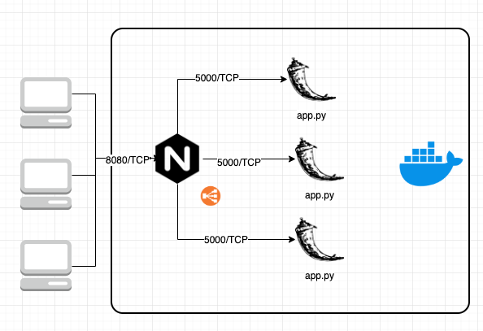

# Day 5 - LAB - Docker Compose


**Objetives:**

- Install Docker-Compose

- Deploy a Flask App behind a NGINX Load balance

- Test the application from a remote browser

  

___





> **Before starting, make sure that there are no containers in running state listening to ports 8080/TCP and 5000/TCP.**


1. **Install Docker****-Compose** using convenience script and make it executable:

```bash
$ sudo curl -L "https://github.com/docker/compose/releases/download/1.24.0/docker-compose-$(uname -s)-$(uname -m)" -o /usr/local/bin/docker-compose

$ sudo chmod +x /usr/local/bin/docker-compose


```

2. **Check** Docker-compose **version** installed:

```bash
$ docker-compose --version
docker-compose version 1.24.0, build 0aa59064

```

3. At Day-5 folder, access ***flask_nginx*** and list the content:

 ```bash
$ ls
docker-compose.yml  flask  nginx
 ```


4. Take a look at ***docker-compose.yml*** file:

```yaml
version: '3'
services:
  nginx:
    build: ./nginx
    links:
     - web1:web1
     - web2:web2
     - web3:web3
    ports:
     - 8080:80
  web1:
    build: ./flask
    ports:
     - "5000:5000"
    volumes:
     - code_volume:/code
  web2:
    build: ./flask
    ports:
     - "5001:5000"
    volumes:
     - code_volume:/code
  web3:
    build: ./flask
    ports:
     - "5002:5000"
    volumes:
     - code_volume:/code
  redis:
    image: "redis:alpine"
volumes:
  code_volume:
```


5. **Check** Flask *Dockerfile* content:

```dockerfile
FROM python:3.4-alpine
ADD . /code
WORKDIR /code
RUN pip install -r requirements.txt
CMD ["python", "app.py"]
```


6. **Check** *NGINX* *Dockerfile* content:

```dockerfile
FROM nginx
COPY nginx.conf /etc/nginx/nginx.conf
```


6. Take a look at ***nginx.conf*** file:

```nginx
worker_processes 4;

events { worker_connections 1024; }

http {

	upstream flask-app {
		least_conn;
		server web1:5000 weight=10 max_fails=3 fail_timeout=10s;
		server web2:5000 weight=10 max_fails=3 fail_timeout=10s;
		server web3:5000 weight=10 max_fails=3 fail_timeout=10s;
	}

	server {
		listen 80;
		location / {

		  proxy_pass http://flask-app;
		  proxy_http_version 1.1;
		  proxy_set_header Upgrade $http_upgrade;
		  proxy_set_header Connection 'upgrade';
		  proxy_set_header Host $host;
		  proxy_cache_bypass $http_upgrade;
		}
	}
}
```


7. **Deploy** the docker-compose service and **check** the services status:

```bash
$ docker-compose up -d
$ docker-compose ls

```

8. **Test the connectivity** from a browser and refresh the page in order to check the container ID and number of requests:

> http://<DOCKER_IP_ADDRESS>:8080/


____

