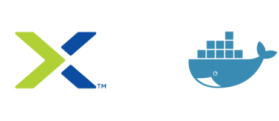

 

# Docker Training - EMEA/2019

### **Table of Contents:**

[**DAY 1**](https://github.com/hutger/docker-training/tree/master/Day-1)

- **Technological Landscape**
  - Microservices
  - Agile and DevOps
  - IaC (Infrastructure as Code)
- **Container Concepts**
- **Kernel Features** (Namespaces, CGroups, )

[**DAY 2**](https://github.com/hutger/docker-training/tree/master/Day-2)

* **Docker Installation**
* **Managing Docker using CLI**

[**DAY 3**](https://github.com/hutger/docker-training/tree/master/Day-3)

* **Dockerfile**

* **Docker Images**

* **Docker Registry**

  

[**DAY 4**](https://github.com/hutger/docker-training/tree/master/Day-4)

* **Docker Volumes**

* **Docker Networking**

  

[**DAY 5**](https://github.com/hutger/docker-training/tree/master/Day-5)

* **Docker Compose**
* **Final Project - Flask App in LB mode**

___

